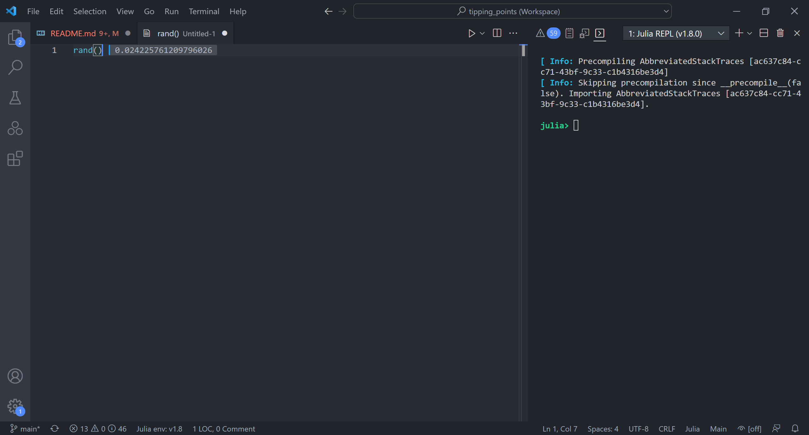
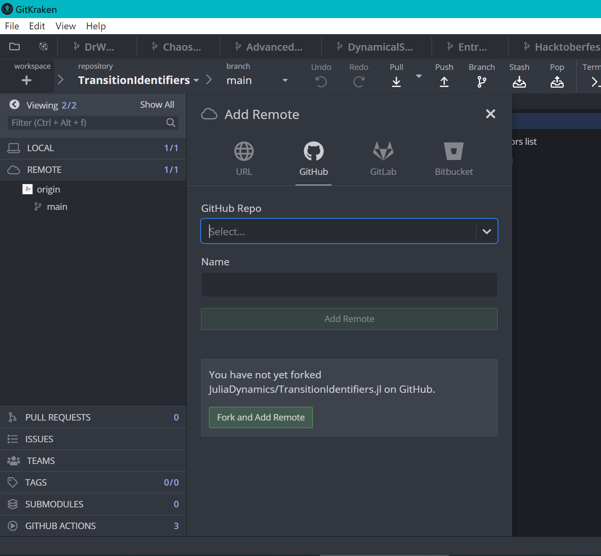
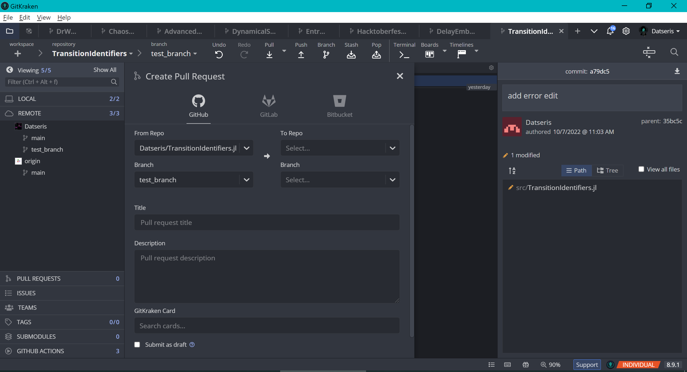

# HacktoberfestHowTo
Welcome! This README contains a basic introduction, helpful tips, and further resources, for participating in Hacktoberfest!

It is aimed mostly at scientists/academics/students that are familiar with programming and would like to contribute/get involved in a community of open source code!

**Table of Contents**
1. [What's Hacktoberfest?](#whats-hacktoberfest)
2. [Why should you participate in Hacktoberfest?](#why-should-you-participate-in-hacktoberfest)
3. [Version control and code collaboration](#version-control-and-code-collaboration)
4. [Consider using GitKraken](#consider-using-gitkraken)
5. [Contributing to Julia packages](#contributing-to-julia-packages)

## What's Hacktoberfest?
Hactoberfest is a month-long celebration of open-source projects, their maintainers, and the entire community of contributors. It is an exciting online event that anyone can join! As you might have guess from the name, it takes place in October. Every October. It is hosted by Digital Ocean and GitHub.

Participation in Hacktoberfest is successfully completed once the participant has completed four (or more or less, depending on the year) **Pull Requests in Open Source Projecs**. If you are not sure yet what is, think of it a pull request as a "unit" of code contribution (more details on this below!).

More details on the official event, and signup, on the official website: https://hacktoberfest.com/

## Why should you participate in Hacktoberfest?
Well, first of all, **it's a damn good cause!**. But besides this, there are some other, equally important, benefits:
1. **Significantly increases your programming skills**. In reality, a code contribution is an act of charity, where you just voluntarily give away your time your code. It is an _exchange_, where you give code contribution in exchange for mentoring!
2. **Teaches you good practices w.r.t. to organizing code**.
3. **Establishes you within a community you are interested in**, such as the developers of a library you use frequently in your work
4. **Makes you more employable by providing you with a stronger GitHub profile**. GitHub is where most modern open source code development takes place. Even entire programming languages like Julia or Python are built on GitHub.

## Version control and code collaboration
To participate in Hacktoberfest, you need to have basic knowledge of Git, a system that controls the versions and history of a code base, and GitHub, a platform where code contributions are performed to existing code bases (among many other things as well). Some academics already know these. If you don't however, do not worry! There are many resources to learn these online. Here is what I would recommend:

- [Block 1](https://github.com/JuliaDynamics/GoodScientificCodeWorkshop/tree/main/block1_git) and [Block 4](https://github.com/JuliaDynamics/GoodScientificCodeWorkshop/tree/main/block4_github) of the Good Scientific Code Workshop. The workshop is also available as a [YouTube recording](https://youtu.be/x3swaMSCcYk).
- [Introduction to GitHub and Open-Source Projects](https://www.digitalocean.com/community/tutorial_series/an-introduction-to-open-source), by Digital Ocean.
- [How To Use Git: A Reference Guide](https://www.digitalocean.com/community/cheatsheets/how-to-use-git-a-reference-guide), by Digital Ocean.
- [How to contribute to open source](https://opensource.guide/how-to-contribute/), by GitHub.

## Consider using GitKraken
[GitKraken](https://www.gitkraken.com/) is a Graphical User Interface for managing git. It is incredibly intuitive, and is free for open source contributions to public projects (this is where valid Hacktoberfest contributions can happen to). Hence, it's free for people that want to participate in Hacktoberfest.

In my experience while teaching the [Good Scientific Code Workshop](https://github.com/JuliaDynamics/GoodScientificCodeWorkshop), **people generally found GitKraken much more intuitive with the standard way to use Git, i.e., as a command line interface**. It's like that it will save you time and effort if you use GitKraken instead. (I am not sponsored by GitKraken in any way).

## Contributing to Julia packages
This section outlines how to contribute to already existing packages for the Julia programming language specifically. If you follow these steps, then in my opinion, you will have the most hassle-free and efficient environment to perform code contributions to Julia packages. Of course, there are many other alternative ways to program and contribute to Julia, but this is my preferred, and in my experience also the most efficient.

1. Install the Julia language, the VSCode editor, and the Julia extension for VSCode: https://www.julia-vscode.org/docs/dev/gettingstarted/#Installation-and-Configuration-1 . After you've done these steps you should have a Julia environment that looks like this: 
2. Set up Revise.jl:
   1. In the VSCode console (or in a script), run `using Pkg; Pkg.add("Revise")`.
   2. Edit your Julia startup file, located at `~/.julia/config/startup.jl`, and add the line `using Revise`.,
   3. Restart Julia
   4. Now, every time Julia starts, the `Revise` package will be enabled. This package allows you to interactively change existing packages under development, and see the result of your changes be reflected live in your Julia session.
3. Put under development the package you would like to contribute to. It is typically recommended to have a dedicated environment for developing some packages. You can activate such a named environment by doing `Pkg.activate ("@NameOfNamedEnvironment")` (notice the `@`, and you need to do this step every time you start a new Julia session). Now, If the package is registered in the general registry, you only need to run the command `using Pkg; Pkg.develop("PackageName")`. If it is not yet registered, you instead develop the GitHub page of the package, such as `Pkg.develop("https://github.com/JuliaDynamics/TransitionIdentifiers.jl")`.
4. After you have put the package under development, just enable it in your Julia session with `using PackageName`. You can then start editing the code of the package, and your edits will be reflected live! For example, try editing an already existing and exported function and put `error("edit!")` in its first line, and then call this function in the Julia console.
5. While editing the package for your code contributions, you need to keep in mind that in the future (once you are done with your edits), you will need to do a Pull Request with your edits to the original repository of the package. For this, the following need to happen:
   1. Open in GitKraken the package folder you've put under development. This folder is located at `~/.julia/dev/PackageName`. Then, **make a new branch named appropriately before you start committing any code changes**. (please don't do code contributions to the default branch called `main`)
   2. Continue with your code modifications to the Julia package source code, and regularly commit your changes to the git history.
   3. Once you are ready with your changes you need to create a Pull Request to the original repository. For this, you first need to _fork_ the original repository, as it is most likely that you won't have Push access to the original (as you are not its owner, most likely). Hence, go to GitHub, to the repository page you have under development, and click "Fork".
   4. In your GitKraken, first connect your GitHub account to it. Then, in the open tab of the code repository we are currently working on, click on remore on the left sidebar, and then add your GitHub fork. It looks like this: 
   5. Finally, right click on your branch, and click "Push and start a pull request". GitKraken will ask you two things here: first, what is the remote branch that you want to push and pull from. This is always your fork! Second, where the pull request should happen to. This is always the `main` branch of the original repository (i.e., not your fork)! Here is how it looks like (always select the original owner of the repo, here JuliaDynamics, and the `main` branch as targets): 